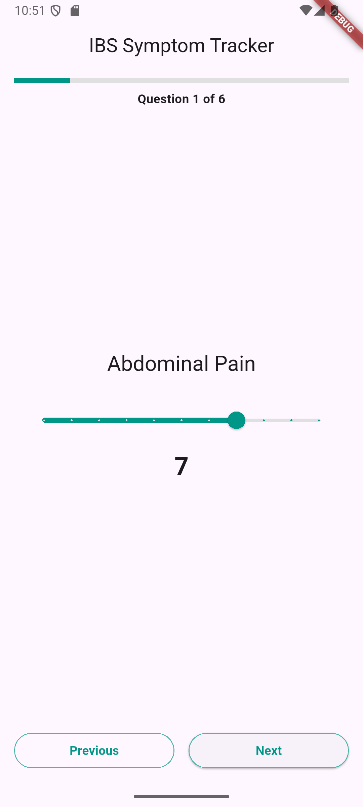
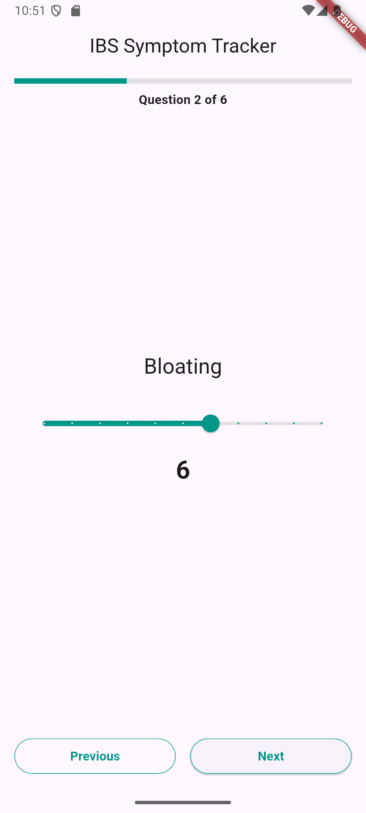
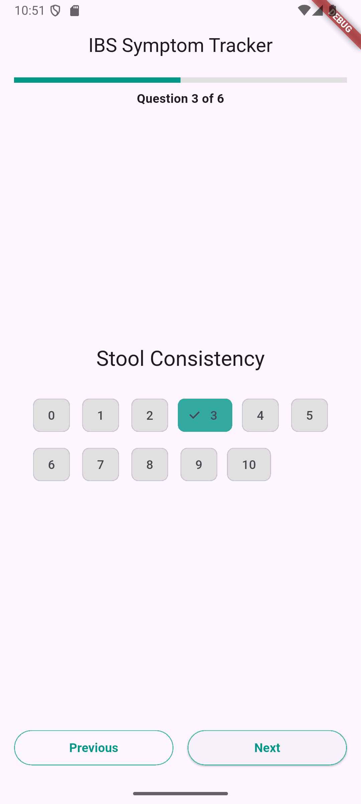
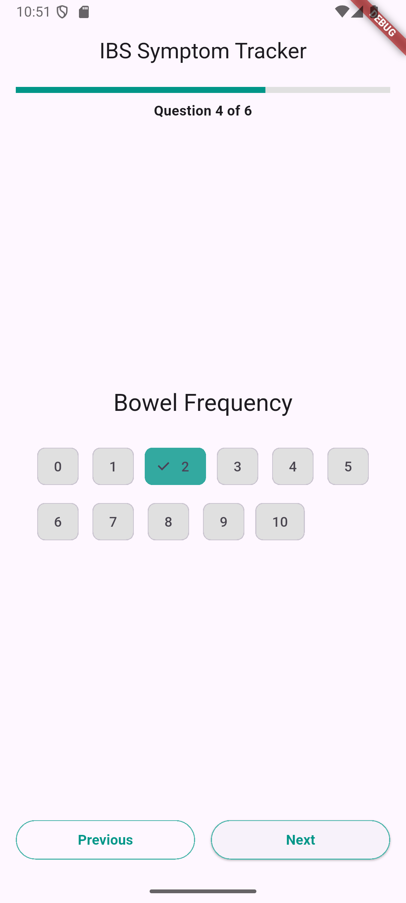
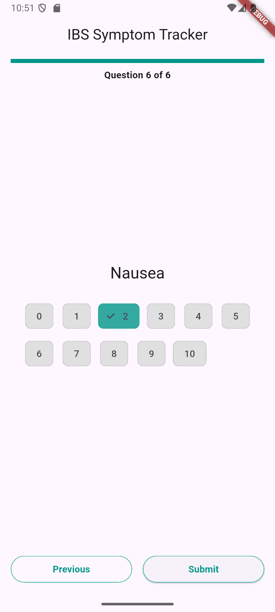
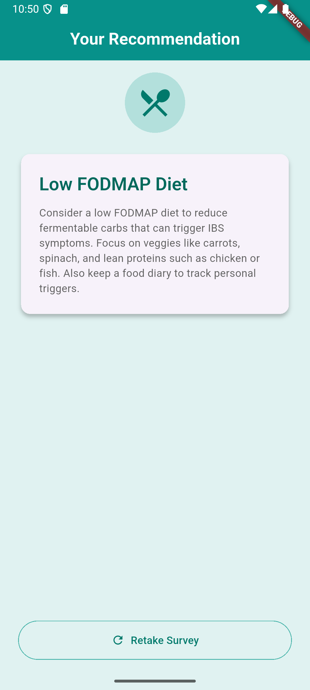

# IBS Symptom Tracker

A simple Flutter proof-of-concept app to track IBS symptoms via a 6-question survey, persist your last responses locally, and get a basic dietary or wellness recommendation.

## Features

1. **Survey UI**  
   - 6 questions:  
     - Abdominal Pain (0–10 slider)  
     - Bloating (0–10 slider)  
     - Stool Consistency (0–10 choice chips)  
     - Bowel Frequency (0–10 choice chips)  
     - Impact on Daily Life (0–10 choice chips)  
     - Nausea (0–10 choice chips)  
   - “Next”/“Previous” navigation with a progress bar  
   - Validates each question before progressing, with inline errors  
   - “Submit” on final page, disabled until all answered  
   - Loading overlay on submit  

2. **Data & Storage**  
   - `SymptomSurveyResult` model (timestamp + responses)  
   - Persists latest result in `shared_preferences`  
   - On app start, loads and pre-fills the last survey  

3. **Recommendation Screen**  
   - If Abdominal Pain > 5 → **Low FODMAP Diet** suggestion  
   - Otherwise → **General Wellness Tip**  
   - Title + description + “Retake Survey” button  

4. **UX Details**  
   - Responsive layout for phones/tablets  
   - Consistent padding, typography, and color (teal accents)  
   - Smooth paging and clear feedback  

---

## Screenshots

### Survey Flow

| Step 1                               | Step 2                               | Step 3                               |
| ------------------------------------ | ------------------------------------ | ------------------------------------ |
|  |  |  |

| Step 4                               | Step 6                               | Recommendation                                    |
| ------------------------------------ | ------------------------------------ | ------------------------------------------------- |
|  |  |  |


---

## Getting Started

### Prerequisites

- Flutter >=3.0.0  
- Dart SDK compatible  
- IDE with Flutter support (Android Studio, VS Code, etc.)

### Installation

```bash
git clone https://github.com/Hami0095/IBS-Symptom-Tracking.git
cd ibs_symptom_tracker
flutter pub get
flutter run
```

### Testing the shared_preferences
- Run the app
- Fill out the survey
- Close the app
- Open the app again
- The survey should be pre-filled with the last result